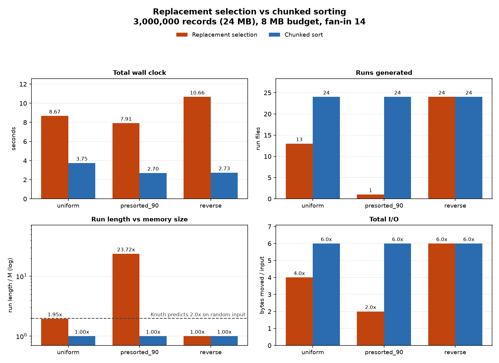

# External merge sort: replacement selection vs chunked sorting

Sorts files far larger than its memory budget, with two different run-generation
algorithms behind the same I/O layer so they can be benchmarked against each other.

Python 3.10+. Needs psutil to read RSS; matplotlib for charts and pytest for the
tests are optional.

Knuth's replacement selection (TAOCP Vol. 3, 5.4.1) generates sorted runs averaging
2M records instead of M, so there are half as many runs to merge. Databases used it
for decades. PostgreSQL deleted it in 2017 ([commit 8b304b8b](https://git.postgresql.org/pg/commitdiff/8b304b8b72b0a60f1968d39f01cf817c8df863ec),
shipped in v11) and the commit message blamed "advances in CPU technology" without
showing numbers. I built both algorithms and measured them.

## Results

3,000,000 records (24 MB) under an 8 MB budget, fan-in 14, i9-14900K with an NVMe SSD:



| engine | workload | runs | run length / M | merge passes | total I/O | wall clock |
|---|---|---|---|---|---|---|
| replacement selection | uniform | 13 | 1.95x | 1 | 4.0x input | 8.67 s |
| chunked sort | uniform | 24 | 1.00x | 2 | 6.0x input | 3.75 s |
| replacement selection | 90% presorted | 1 | 23.72x | 0 | 2.0x input | 7.91 s |
| chunked sort | 90% presorted | 24 | 1.00x | 2 | 6.0x input | 2.70 s |
| replacement selection | reverse sorted | 24 | 1.00x | 2 | 6.0x input | 10.66 s |
| chunked sort | reverse sorted | 24 | 1.00x | 2 | 6.0x input | 2.73 s |

Replacement selection does everything the theory promises and loses anyway.

- **It hits the numbers.** 1.95x M on random data, matching Knuth's 2M prediction,
  and it swallows a 90% presorted file in one run with no merge phase at all.
- **The I/O it saves is cheap.** Even in its best case it moves a third of the bytes
  (2.0x against 6.0x) and still loses by 2.9x, because an NVMe drive returns 4 MB
  faster than the interpreter sifts a heap 3 million times.
- **Usually it saves nothing.** Merge passes are `ceil(log_fanin(runs))`, a step
  function, so halving the run count only helps when the two counts straddle a power
  of the fan-in. On reverse-sorted input both engines made 24 runs and 2 passes, so
  the heap cost bought nothing at all.

On simulated slow storage the result flips: replacement selection wins above about
0.5 ms per I/O, roughly where storage sat before flash. The
[analysis](docs/analysis.md) covers the crossover, a 1 GB run, and the caveats.

## Try it

```
pip install -r requirements.txt
python cli.py bench --records 500000 --budget-mb 4 --distributions uniform --no-plot
```

Generates the dataset, runs both engines, verifies both outputs against the input
checksum, and prints the whole finding in under 2 seconds:

```
budget=4.0 MB  bytes/record=56.0  M=55,044 records  fan-in=6
  fan-in clamped to 6: read buffers for the requested fan-in do not fit the budget
  knuth    uniform          0.89s     6 runs  1 passes  verified
  chunked  uniform          0.33s    10 runs  2 passes  verified

engine   dist     runs  run/M  passes  sift/rec  gen s  merge s  total s  io amp  ok
-------  -------  ----  -----  ------  --------  -----  -------  -------  ------  ---
knuth    uniform  6     1.81x  1       13.8      0.77   0.12     0.89     4.0x    yes
chunked  uniform  10    1.00x  2       0.0       0.12   0.21     0.33     6.0x    yes

uniform  runs 6 vs 10 | passes 1 vs 2 | I/O 4.0x vs 6.0x
         chunked wins by 2.70x, knuth breaks even at 4.61 ms/IO
```

Fewer runs, one less merge pass, a third less I/O, and it still loses by 2.7x.

Other commands:

```
python cli.py bench --records 3000000 --budget-mb 8      # the table above, plus a chart
python cli.py crossover --block-records 1024 --fan-in 20 # sweep simulated storage latency
python cli.py memtrap                                    # CPython's per-record overhead
python -m pytest tests/ -v                               # 47 tests
```

## How it works

```
  input.bin
      |
      v
  io_channel.py         fixed-width uint64, hand-buffered blocks
      |
      v
  run generation        the only thing that differs between the two engines
      |
      +--- A  replacement_selection.py    min-heap, runs average 2M
      |
      +--- B  chunked_sort.py             fill M, list.sort(), flush
      |
      v
  run files on disk
      |
      v
  merger.py             cascading k-way merge, bounded fan-in
      |
      v
  sorted.bin            verified by (count, sum, xor) against the input
```

Both engines share the I/O layer, the memory budget and the merger, so run
generation is the only variable.

Records are fixed-width little-endian `uint64`, so a whole block decodes with one
`struct.unpack` instead of one call per record. Files are opened with `buffering=0`
and buffered by hand, which makes one write in `io_channel` exactly one syscall and
keeps the I/O counters meaningful.

**Replacement selection** runs inside one pre-allocated list holding an active
min-heap on the left and records deferred to the next run on the right:

```
buf: [0 .......... heap_size) [holes) [filled-parked ...... filled)
      active min-heap                  parked for the next run
```

When an incoming record is smaller than the one just emitted it cannot join the
current run without breaking sorted order. Shrinking the heap by one frees exactly
the slot needed to park it, so deferring a record costs no extra memory and the two
regions can never collide. When the heap empties, the parked records slide to the
front and become the next run's heap. Nothing is allocated in the steady-state loop.

**The merger** cascades, combining batches of at most `fan_in` runs into a new
generation until one file is left. Fan-in is bounded by memory before file
descriptors here: each open run needs a decoded block buffer, and 8192 records is
8192 Python integers, about 460 KB. With an 8 MB budget only 14 fit, so the harness
clamps the requested 32 and says so.

**The memory budget is derived, not assumed.** A key is 8 bytes on disk but 56 in a
Python list, an 8-byte pointer plus a heap-allocated integer object. Sizing the
buffer as `budget // 8` would use seven times the ceiling it claims to respect.
`python cli.py memtrap` measures it.

## Tests

47 tests, `python -m pytest tests/ -v`, run in CI on Python 3.10 through 3.13.

`test_engines.py` covers the machinery: round-trips, boundary cases (empty file,
one record, exactly M, M+1) and the algorithmic invariants. Replacement selection
averages 1.8x to 2.2x M on random input, produces exactly one run when the input is
already sorted and collapses to exactly 1.0x M when it is reversed; chunked runs are
always exactly M; 20 runs at fan-in 3 cascade without ever opening more than 3 files.

`test_findings.py` asserts the result rather than the code. Wall clock is
machine-specific, so nothing there asserts a time, but run counts, merge depth and
I/O amplification are not, which means CI re-derives the finding on hardware I do
not own. If replacement selection stops reaching 2M, or stops removing a merge pass
at a fan-in sitting between the two run counts, or ever stops tying with chunked
sorting on reversed input, the build fails.

Every sort is verified three ways: each run is asserted individually sorted, input
and output are compared by `(count, sum mod 2^64, xor)` since a sortedness check
alone passes an engine that silently drops records, and both engines' outputs are
asserted byte-identical to each other.

## What I got wrong

My first sift-down compared the two children against `buf[smallest]` rather than
against the item being pushed down. After one level of descent that slot has already
been overwritten by the promoted child, so the comparison used a value smaller than
the item and skipped swaps it should have made. Nothing crashed. The heap property
broke at one node, runs came out very slightly unsorted, and I found out at the end
when the merged output was wrong. Holding the item in a local and comparing the
children against each other first fixes it. `test_heapify_matches_heapq` checks the
heap property at every parent/child pair over 200 random inputs and would have caught
it immediately.

The second bug was in the end-of-input path. I derived the parked count as
`filled - heap_size`, which holds until the input runs out and the draining heap
starts leaving holes behind it. After that the two disagree, the run transition
re-heapified garbage, and records got duplicated. Tracking `parked` as its own
counter fixed it.

## Limits

The run generators are pure Python, so the CPU side is interpreted bytecode while
`list.sort()` is C. That inflates the constant against replacement selection without
changing its direction: AlphaSort measured 2.5:1 for the same comparison in C. The
I/O counts and sift steps are language-independent; the wall clock is not.

Cache behaviour is inferred rather than measured, since Python cannot read miss
rates. The latency simulation charges a fixed delay per block I/O, which is
pessimistic for sequential streaming, though it is applied identically to both
engines. Full caveats are in the [analysis](docs/analysis.md).

Next: variable-length records with a key plus payload, where replacement selection
gets worse because whole tuples move through the heap, and two-way replacement
selection ([VLDB 2010](https://vldb.org/pvldb/vol3/R78.pdf)), which uses two heaps
to avoid the reverse-sorted collapse.

## References

- Knuth, *The Art of Computer Programming* Vol. 3, section 5.4.1
- Nyberg et al., [AlphaSort: A Cache-Sensitive Parallel External Sort](https://jimgray.azurewebsites.net/papers/alphasortsigmod.pdf), SIGMOD 1994
- Larson, *External sorting: Run formation revisited*, IEEE TKDE 2003
- Geoghegan, [The case for removing replacement selection sort](https://postgrespro.com/list/id/CAH2-WzmmNjG_K0R9nqYwMq3zjyJJK+hCbiZYNGhAy-Zyjs64GQ@mail.gmail.com), pgsql-hackers 2017
