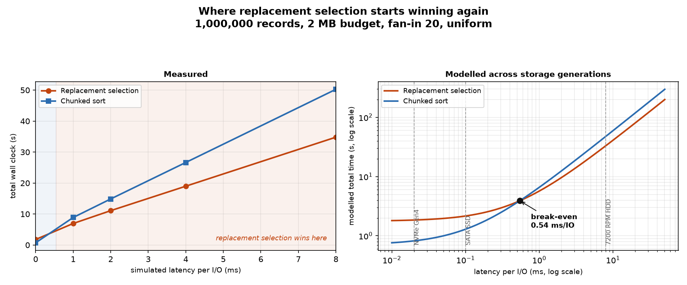

# Analysis

Longer write-up of the results summarised in the [README](../README.md): where the
I/O saving comes from, why it usually fails to pay, and the point on the storage
timeline where it starts paying again.

## 1. Why fewer runs usually buys nothing

Replacement selection's whole argument is that halving the run count shrinks the
merge tree. The merge tree depth is

```
passes = ceil(log_fanin(runs))
```

which is a step function. Going from 24 runs to 13 only removes a pass if the two
counts straddle a power of the fan-in. At fan-in 14, 13 runs need one pass and 24
need two, so the saving lands. At fan-in 32 both 73 runs and 143 runs need two
passes, so it does not.

Knuth was designing for tape drives, where fan-in was the number of physical
drives you owned, typically 3 to 6. At fan-in 4, halving the run count removes a
pass roughly half the time. At fan-in 32 or 100 it almost never does, because
both counts land in the same bucket. The algorithm did not get worse. The
hardware moved the fan-in up by an order of magnitude and quietly deleted the
mechanism it depended on.

This is worth separating from the cache argument, which usually gets all the
attention. Even in a world with free heap maintenance, replacement selection
would still fail to remove a pass most of the time at modern fan-in.

## 2. Full results, 3M records under an 8 MB budget

Fan-in 32 requested, clamped to 14 (see section 4).

| workload | engine | runs | run/M | passes | I/O | gen s | merge s | total s | break-even |
|---|---|---|---|---|---|---|---|---|---|
| uniform | replacement selection | 13 | 1.95x | 1 | 4.0x | 7.30 | 1.37 | 8.67 | 6.57 ms/IO |
| uniform | chunked | 24 | 1.00x | 2 | 6.0x | 1.28 | 2.46 | 3.75 | |
| presorted 90% | replacement selection | 1 | 23.72x | 0 | 2.0x | 7.91 | 0.00 | 7.91 | 3.38 ms/IO |
| presorted 90% | chunked | 24 | 1.00x | 2 | 6.0x | 0.56 | 2.14 | 2.70 | |
| reverse | replacement selection | 24 | 1.00x | 2 | 6.0x | 8.43 | 2.23 | 10.66 | never |
| reverse | chunked | 24 | 1.00x | 2 | 6.0x | 0.51 | 2.22 | 2.73 | |

The gen/merge split is the interesting column, not the total.

On uniform data replacement selection's merge phase really is faster, 1.37 s
against 2.46 s, because it merges 13 files in one pass instead of 24 files in
two. It buys that 1.1 s by spending 6.0 s more on run generation.

On presorted data it produces a single run, so there is no merge phase at all.
That saves the full 2.14 s and costs 7.4 s more to generate. This is the
algorithm's best case and it still loses by 2.9x.

On reverse-sorted data every incoming record is smaller than the one just
emitted, so every record is parked immediately and every run is exactly M. Same
24 runs, same 2 passes, same 6.0x I/O as chunked sorting, with the entire heap
cost paid for nothing. That is the worst case and it is not an exotic one:
`ORDER BY x DESC` over a table already clustered ascending produces it.

## 3. Scaling to 1 GB

125,000,000 records under a 50 MB budget, a 20:1 ratio of data to memory,
fan-in 32.

| engine | runs | run/M | passes | peak RSS growth | total |
|---|---|---|---|---|---|
| replacement selection | 73 | 1.98x | 2 | 53.9 MB | 442.8 s |
| chunked | 143 | 1.00x | 2 | 9.2 MB | 104.6 s |

Two things to take from this. The 2M prediction holds at scale: 1.95x at 3M
records, 1.98x at 125M, converging on the theoretical 2.0 as the number of runs
grows and the truncated final run matters less.

And the 70 fewer run files bought nothing at all, because 73 and 143 both need
two passes at fan-in 32. This is section 1 happening at scale.

Both engines stayed inside the budget and both outputs verified against the
input checksum.

## 4. Fan-in is bounded by memory before file descriptors

The usual reason given for capping fan-in is the open file limit, 1024 on Linux
and 512 for the Windows C runtime. That is real, but memory binds first here.

Each open run needs a decoded block buffer. A block of 8192 records is not 64 KB,
it is 8192 Python integers, about 460 KB. With an 8 MB budget only 14 of those
fit alongside the output buffer, so the harness clamps the requested 32 down to
14 and says so:

```
fan-in clamped to 14: read buffers for the requested fan-in do not fit the budget
```

Halving the block size doubles the affordable fan-in. That is the real tradeoff:
larger blocks amortise syscalls, smaller blocks buy merge width.

## 5. The crossover experiment

`--latency-ms` charges every block read and write a fixed delay, which simulates
storage slower than NVMe. Sweeping it walks the hardware timeline backwards.



1,000,000 records, 2 MB budget, fan-in 20, 1024-record blocks.

The fan-in and block size are chosen deliberately. Fan-in 20 sits between the two
engines' run counts, so replacement selection's 16 runs merge in one pass while
chunked's 30 need two. Without that gap both engines do the same number of passes
and there is no I/O difference for latency to amplify. The smaller blocks raise
the I/O operation count so the effect is visible at latencies `time.sleep()` can
actually produce.

| latency per I/O | replacement selection | chunked | winner |
|---|---|---|---|
| 0 ms (native NVMe) | 1.79 s | 0.72 s | chunked, 2.5x |
| 1 ms | 6.95 s | 8.88 s | replacement selection, 1.28x |
| 2 ms | 11.09 s | 14.87 s | replacement selection, 1.34x |
| 4 ms | 18.99 s | 26.65 s | replacement selection, 1.40x |
| 8 ms | 34.81 s | 50.26 s | replacement selection, 1.44x |

Run counts 16 vs 30, merge passes 1 vs 2, I/O operations 3,920 vs 5,872.

### Deriving the break-even

Each engine costs roughly its CPU time plus one latency charge per I/O:

```
total(latency) = cpu + ops * latency
```

Setting the two equal and solving for latency:

```
latency_breakeven = (cpu_knuth - cpu_chunked) / (ops_chunked - ops_knuth)
                  = 0.54 ms per I/O
```

Both inputs come from the zero-latency run, so the whole curve is predicted from
one measurement. The measured flip lands between 0 and 1 ms, which agrees.

For orientation: NVMe Gen4 is 0.02 to 0.08 ms, a SATA SSD about 0.1 ms, a
7200 RPM disk 5 to 15 ms. The break-even falls in the gap between flash and
spinning disks, which is the hardware transition that made the algorithm
obsolete.

### Why the break-even differs between experiments

The default 8192-record block run reports 6.57 ms/IO and this one reports 0.54.
Same code, same conclusion, different denominator. Latency is charged per
operation, so 8x smaller blocks means 8x more operations to amplify, and the
break-even drops by roughly that factor. Quoting either number without its block
size is meaningless.

The harness returns no break-even at all when replacement selection did not
remove a merge pass. In that case the I/O counts are nearly identical, there is
nothing for a slow device to amplify, and no latency rescues it. That is the
`reverse` row in section 2.

## 6. Why the memory budget is not budget // 8

A key is 8 bytes on disk. In a Python list it is an 8-byte pointer plus a heap
allocated integer object.

```
$ python cli.py memtrap
1,000,000 64-bit keys
  packed on disk            8.00 MB     8.0 bytes/record
  python list of ints      56.86 MB    56.9 bytes/record
  array.array('Q')          8.96 MB     9.0 bytes/record
  sys.getsizeof(one int)         36 bytes  (+8 for the list slot)
```

Sizing the sort buffer as `budget // 8` would use about seven times the ceiling
it claims to respect, and every "sorts 1 GB in 50 MB" claim in this repo would be
false. `bytes_per_record()` derives the real figure as 8 plus the allocator
rounded size of an integer object, which is 56 on CPython 3.12 and later.

It is derived rather than sampled on purpose. Sampling RSS varied by about 7% run
to run, which changed M, which changed the run count, which changed the merge
pass count. A repo that prints a different table every time you run it is not
worth much. A test cross-checks the derived value against real RSS in a fresh
interpreter.

`array.array('Q')` would cost 9 bytes per record instead of 56, but it has no
in-place `.sort()`, so the chunked engine would need `sorted(arr)`, which
materialises a boxed list anyway and turns a steady footprint into a transient
spike. Element access also boxes an integer on every read, which the heap loop
pays for on every comparison. Using a list for both engines keeps M and the
per-record footprint identical between them, which matters more here than
absolute efficiency.

## 7. What these numbers do not show

**Pure Python inflates the CPU gap.** The heap loop is interpreted bytecode and
`list.sort()` is C. Dividing the CPU difference by a rough 50x interpreter
handicap moves the break-even to about 0.01 ms/IO, which is faster than NVMe. So
the conclusion survives a C rewrite, but by a factor of a few rather than a
factor of ten. That narrowness is why this was argued about on pgsql-hackers for
years instead of being obvious. AlphaSort measured 2.5:1 for the same comparison
in C.

**The latency model charges a seek per block.** Real sequential streaming would
not pay full access latency per 8 KB, so the model is pessimistic. It is applied
identically to both engines, so the comparison holds, and it does describe a
device where every access really does cost: a contended shared volume or network
block storage.

**`time.sleep()` on Windows overshoots.** A requested 1 ms sleeps about 1.45 ms
here and anything under 0.5 ms rounds up. That is why the sub-millisecond region
comes from the model rather than a finer sweep, and why the measured points sit
slightly above the modelled lines.

**Cache behaviour is inferred, not measured.** Python cannot read L1/L2 miss
rates. What is measured is `sift_steps_per_record`, about 15 dependent pointer
hops per record across a buffer far larger than L2. That is a proxy for cache
pressure, not proof of it. Proving it needs `perf stat -e cache-misses` against a
C port.

## 8. What PostgreSQL actually did

Replacement selection was removed from `tuplesort.c` in commit
[8b304b8b](https://git.postgresql.org/pg/commitdiff/8b304b8b72b0a60f1968d39f01cf817c8df863ec),
committed 2017-09-29 by Robert Haas, patch by Peter Geoghegan. It shipped in
PostgreSQL 11. The same commit removed the `replacement_sort_tuples` setting,
which had been added in 9.6 as a compromise that kept replacement selection for
the first run of small sorts only.

The commit message:

> At the time replacement_sort_tuples was introduced, there were still cases
> where replacement selection sort noticeably outperformed using quicksort even
> for the first run. However, those cases seem to have evaporated as a result of
> further improvements made since that time (and perhaps also advances in CPU
> technology).

The documentation for the setting it removed had already made the cache
argument: the priority queue "is sensitive to the size of available CPU cache,
whereas the default strategy sorts runs using a cache oblivious algorithm".

Geoghegan's [thread](https://postgrespro.com/list/id/CAH2-WzmmNjG_K0R9nqYwMq3zjyJJK+hCbiZYNGhAy-Zyjs64GQ@mail.gmail.com)
adds two arguments beyond cache behaviour. Merge heap improvements in PostgreSQL
10 fixed the presorted case for every sort strategy, not just this one. And the
single-big-run path was optimised for random access, so it could not exploit the
preloading and readahead that made one long run worth having in the first place.

## References

- Knuth, *The Art of Computer Programming* Vol. 3, section 5.4.1
- Nyberg et al., [AlphaSort: A Cache-Sensitive Parallel External Sort](https://jimgray.azurewebsites.net/papers/alphasortsigmod.pdf), SIGMOD 1994
- Larson, *External sorting: Run formation revisited*, IEEE TKDE 2003
- [Two-way Replacement Selection](https://vldb.org/pvldb/vol3/R78.pdf), VLDB 2010
